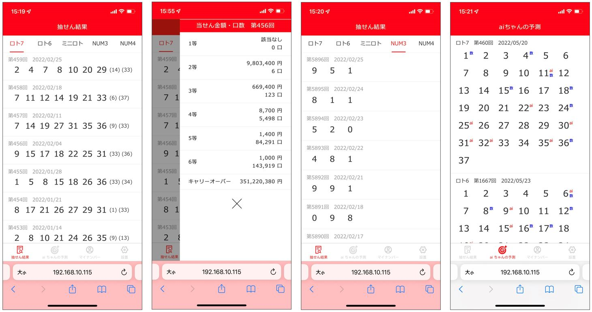
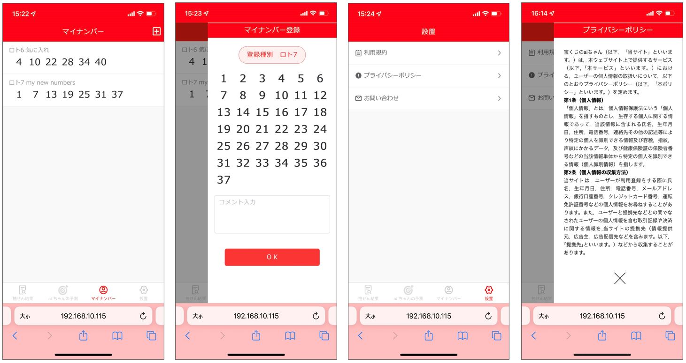

# 宝くじのaiちゃん
宝くじ当選結果の確認、確率理論・AI理論で当選番号予測、マイナンバー登録のウェブ・携帯アプリです。

### 技術スタック
Python、Flask、pyTorch、PostgreSQL

Javascript、HTML/CSS、Vue.js、Quasar

### バックエンドの仕組み
 - フロントエンドとの通信はFlask REST APIで実装
 - 過去の当選結果、マイナンバーをpostgreSQLに格納
 - pyTorchのCNNで過去の当選結果に基づいて予測を行う

### 当選番号予測について
確率理論とAI理論で番号予測を行います。
過去当選番号を加工処理したdatasetsを作成、pyTorchを用いてオリジナルのCNNモデルをトレーニングして当選番号を予測する。
datasets、AIモデルなどの詳細は、predictionソースを確認してください。

### デプロイについて
docker-composeの中にpostgresDB、apiサーバ、nginx三つのコンテイナーが配置される。
dockerコマンドでデプロイを行う。詳細についてconfigsファイルを確認してください。

### 主な機能
 - ロト７、ロト６、ミニロト、Numbers3、Numbers4の当選結果確認
 - ロト７、ロト６、ミニロト、Numbers3、Numbers4の当選詳細（当選金額、口数）の照合
 - 次期当選番号が確率理論とAIモデルで分析して予想を行います。
 - 気に入れのマイナンバーを登録

### Webアプリ画面の一部抜粋

